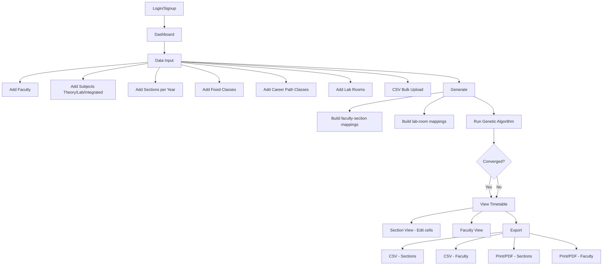

# 📋 Timetable Generator — Complete Project Analysis

> A full-stack **CSE Timetable Generator** built with **Vite + React + TypeScript + TailwindCSS + shadcn/ui**, using **Supabase** for authentication and cloud data persistence. The core scheduling engine uses a **Genetic Algorithm (GA)** with hard/soft constraint evaluation.

---

## 🏗️ Tech Stack

| Layer | Technology |
|-------|-----------|
| **Framework** | Vite + React 18 + TypeScript |
| **Styling** | TailwindCSS + shadcn/ui (49 Radix-based components) |
| **State Management** | React Context + `useReducer` |
| **Routing** | React Router DOM v6 |
| **Backend/DB** | Supabase (PostgreSQL + Auth) |
| **Data Fetching** | TanStack React Query |
| **Forms** | React Hook Form + Zod validation |
| **Charts** | Recharts |
| **Testing** | Vitest + Testing Library |

---

## 📁 Directory Structure

```
timtablegen2914/
├── index.html                # Entry HTML file
├── package.json              # Dependencies & scripts
├── vite.config.ts            # Vite configuration
├── tailwind.config.ts        # Tailwind theme config
├── tsconfig*.json            # TypeScript configs
├── .env                      # Environment variables
│
├── public/                   # Static files (favicon, robots.txt)
│
├── supabase/
│   └── migrations/           # SQL migration for DB tables
│
└── src/
    ├── main.tsx              # React entry point
    ├── App.tsx               # Root component (routing + providers)
    ├── index.css             # Global CSS + Tailwind base
    ├── App.css               # App-level styles
    │
    ├── pages/                # 📄 Page-level UI components
    ├── components/           # 🧩 Reusable UI components
    │   ├── ui/               # shadcn/ui primitives (49 files)
    │   ├── layout/           # App layout shell
    │   └── timetable/        # Timetable grid display
    │
    ├── core/                 # 🧠 Algorithm & scheduling logic
    ├── contexts/             # 🌐 React Context providers
    ├── hooks/                # 🪝 Custom React hooks
    ├── types/                # 📐 TypeScript type definitions
    ├── utils/                # 🔧 Utility functions
    ├── integrations/         # 🔌 External service integrations
    │   └── supabase/         # Supabase client & types
    ├── lib/                  # Helper library (cn utility)
    └── test/                 # Test setup & example
```

---

## 🗂️ File-by-File Breakdown

### 📄 Pages (`src/pages/`)

| File | Route | Purpose |
|------|-------|---------|
| [Index.tsx](file:///g:/6th%20sem/timtablegen2914/src/pages/Index.tsx) | `/` | **Dashboard** — shows stat cards (faculty count, subjects, sections, fixed classes, career path, timetable status) + a quick guide |
| [DataInput.tsx](file:///g:/6th%20sem/timtablegen2914/src/pages/DataInput.tsx) | `/input` | **Data Input** — huge form page (36KB!) for adding faculty, subjects, sections, fixed classes, career path classes, lab rooms. Supports CSV uploads for bulk input |
| [Generate.tsx](file:///g:/6th%20sem/timtablegen2914/src/pages/Generate.tsx) | `/generate` | **Generate** — runs the Genetic Algorithm, shows progress bar, displays result (fitness score, generation count, convergence status) |
| [ViewTimetable.tsx](file:///g:/6th%20sem/timtablegen2914/src/pages/ViewTimetable.tsx) | `/view` | **Section View** — shows generated timetable per section in a grid. Cells are editable (click to change subject/faculty). Validates edits against constraints |
| [FacultyTimetable.tsx](file:///g:/6th%20sem/timtablegen2914/src/pages/FacultyTimetable.tsx) | `/faculty-view` | **Faculty View** — shows per-faculty timetable with break/lunch columns, session type badges (Lab/Theory/CP), weekly hour stats |
| [Export.tsx](file:///g:/6th%20sem/timtablegen2914/src/pages/Export.tsx) | `/export` | **Export** — CSV export (section & faculty), HTML print/PDF export, "Reset All Data" danger button |
| [Login.tsx](file:///g:/6th%20sem/timtablegen2914/src/pages/Login.tsx) | `/login` | **Login** — email/password sign-in via Supabase Auth |
| [Signup.tsx](file:///g:/6th%20sem/timtablegen2914/src/pages/Signup.tsx) | `/signup` | **Signup** — registration with display name |
| [NotFound.tsx](file:///g:/6th%20sem/timtablegen2914/src/pages/NotFound.tsx) | `*` | **404** — simple not found page |

---

### 🧠 Core Algorithm (`src/core/`)

This is the **brain** of the app — the actual timetable scheduling logic.

#### [geneticAlgorithm.ts](file:///g:/6th%20sem/timtablegen2914/src/core/geneticAlgorithm.ts) — 918 lines
The main scheduling engine using a **Genetic Algorithm**:

- **Config**: Population size = 60, Max generations = 500, Mutation rate = 20%, Elite count = 5
- **Seeded PRNG** (mulberry32, seed=42) for deterministic, reproducible results
- **Chromosome = `ClassSession[]`** — each individual is a complete timetable

**GA Phases:**
1. `generateRandomChromosome()` — places fixed classes → career path classes → lab/integrated blocks → theory sessions
2. `tournamentSelect()` — tournament selection (size 3)
3. `crossover()` — section-based crossover, career path always from parent1
4. `mutate()` — 50% faculty swap or time slot reassignment
5. `repair()` — fixes career path sync, duplicate slots, faculty conflicts, lab continuity, leisure violations
6. `repairLeisure()` — ensures mandatory slots (0,1,2,4) are filled, leisure only at slots 3 or 5
7. `ensureLabContinuity()` — guarantees lab sessions are in 2-hour continuous blocks

**Convergence**: Fitness ≤ 1 = perfect solution.

---

#### [constraintEngine.ts](file:///g:/6th%20sem/timtablegen2914/src/core/constraintEngine.ts) — 539 lines
Evaluates timetable quality with **hard constraints** (penalty=1000) and **soft constraints** (penalty=3-10):

**Hard Constraints:**
| Constraint | What it checks |
|-----------|----------------|
| Faculty conflicts | No faculty double-booked at same day+slot |
| Back-to-back | No consecutive theory classes for same faculty (lab 2-hr blocks OK) |
| Post-lab free | Faculty must have a free slot after a lab block |
| First-hour diversity | Same subject can't be at slot 0 on multiple days for a section |
| No theory repeats | Theory subject can't appear twice on the same day per section |
| Valid slots only | All sessions in valid slot range |
| Lab continuity | Lab/integrated subjects must be in exactly 2-hour continuous blocks |
| Career path sync | All sections of a year have the same day+slot for career path |
| Faculty mapping | Pre-assigned faculty mappings can't be changed |
| Integrated rules | Integrated subjects: no 3+ hours same day, theory not adjacent to lab |
| Leisure placement | Leisure ONLY at slot 3 (12:10-1:10) or slot 5 (3:00-4:00); never at slot 0 or 4; max 1/day |
| Lab room clashes | No two different section+subjects in same lab room at same time |
| Lab room mapping | Lab room assignments are immutable |

**Soft Constraints:**
- Late slot penalty (slot 6 = 5 points)
- Faculty overload (>4 classes/day = 10 × excess)
- Idle gaps between sessions (3 × gap size)
- Faculty workload imbalance (5 × excess imbalance)

---

#### [timeSlotManager.ts](file:///g:/6th%20sem/timtablegen2914/src/core/timeSlotManager.ts) — 66 lines
Manages the **7 daily time slots**:

| Slot | Time | Notes |
|------|------|-------|
| 0 | 09:00-10:00 | Morning |
| 1 | 10:00-11:00 | Morning |
| — | 11:00-11:10 | **BREAK** (implicit, not a slot) |
| 2 | 11:10-12:10 | |
| 3 | 12:10-13:10 | Can be leisure |
| — | 13:10-14:00 | **LUNCH** (implicit, not a slot) |
| 4 | 14:00-15:00 | After lunch |
| 5 | 15:00-16:00 | Can be leisure |
| 6 | 16:00-17:00 | Optional (soft penalty) |

- Slots 3→4 NOT consecutive (lunch break)
- Supports optional slot 6 on specific days

---

#### [facultySectionAssigner.ts](file:///g:/6th%20sem/timtablegen2914/src/core/facultySectionAssigner.ts) — 135 lines
Pre-assigns faculty to sections for multi-faculty subjects BEFORE the GA runs:

- **Scenario 1**: 2 faculty – 4 sections → 2 sections each
- **Scenario 2**: 4 faculty – 4 sections → 1 each
- **Scenario 3**: 3 faculty – 4 sections → 1+1+2 (lowest-load gets extra)
- Uses global workload balancing across all subjects

---

### 📐 Type Definitions (`src/types/timetable.ts`)

The complete data model:

| Type | Fields | Purpose |
|------|--------|---------|
| `Faculty` | `id`, `shortName` | A teacher |
| `Subject` | `code`, `name`, `facultyId`, `eligibleFacultyIds`, `weeklyHours`, `subjectType`, `labHours`, `yearNumber`, `labRoomId` | A course |
| `Section` | `id`, `yearNumber`, `name` | E.g., "Year 2 - Section A" |
| `TimeSlot` | `day`, `slotIndex`, `startTime`, `endTime` | One period |
| `ClassSession` | `sectionId`, `yearNumber`, `subjectCode`, `facultyId`, `secondFacultyId`, `day`, `slotIndex`, `isFixed`, `isCareerPath`, `labRoomId`, `careerPathSlotType` | One scheduled class in the timetable |
| `FixedClass` | Same as session core fields | Classes pinned to specific day+slot |
| `CareerPathClass` | + `slotType` ('theory'/'lab') | Career path subjects shared across all sections of a year |
| `LabRoom` | `id`, `name`, `capacity`, `subjectCodes` | Physical lab rooms |
| `LabRoomMapping` | `subjectCode`, `sectionId`, `labRoomId`, `yearNumber` | Fixed lab-to-section assignment |
| `FacultySectionMapping` | `subjectCode`, `sectionId`, `facultyId`, `yearNumber` | Pre-assigned faculty-to-section |
| `TimetableData` | All of the above + `generatedTimetable` | The complete app state |

**Enums:**
- `Day`: Monday–Friday
- `SubjectType`: Theory, Lab, Integrated

---

### 🌐 Contexts (`src/contexts/`)

#### [TimetableContext.tsx](file:///g:/6th%20sem/timtablegen2914/src/contexts/TimetableContext.tsx)
Central state manager using `useReducer` with **43 action types** (SET/ADD/UPDATE/REMOVE for faculty, subjects, sections, fixed/career classes, lab rooms, mappings, timetable).

**Data Persistence (dual-layer):**
1. **localStorage** — always saved immediately (key: `cse-timetable-data`)
2. **Supabase** — debounced save (2-second delay) to `user_timetable_data` table as JSONB

On login, data loads from Supabase. On every state change, saves to both localStorage and Supabase.

#### [AuthContext.tsx](file:///g:/6th%20sem/timtablegen2914/src/contexts/AuthContext.tsx)
Wraps Supabase Auth. Provides `signUp`, `signIn`, `signOut`, and reactive `user`/`session` state via `onAuthStateChange`.

---

### 🔌 Supabase Integration (`src/integrations/supabase/`)

#### [client.ts](file:///g:/6th%20sem/timtablegen2914/src/integrations/supabase/client.ts)
Creates the Supabase client with URL and anon key. Auth uses localStorage for session persistence.

#### [types.ts](file:///g:/6th%20sem/timtablegen2914/src/integrations/supabase/types.ts)
Auto-generated TypeScript types for the database schema.

---

### 🗄️ Database Schema (`supabase/migrations/`)

Two tables with Row Level Security (RLS):

#### `profiles`
| Column | Type | Description |
|--------|------|-------------|
| `id` | UUID (PK) | Auto-generated |
| `user_id` | UUID (FK → auth.users) | Unique per user |
| `display_name` | TEXT | User's display name |
| `created_at` | TIMESTAMPTZ | Auto timestamp |

- Auto-created by trigger `on_auth_user_created` on signup
- RLS: users can only see/edit their own profile

#### `user_timetable_data`
| Column | Type | Description |
|--------|------|-------------|
| `id` | UUID (PK) | Auto-generated |
| `user_id` | UUID (FK → auth.users) | Unique per user |
| `data` | JSONB | **All timetable data as a single JSON blob** |
| `updated_at` | TIMESTAMPTZ | Last modified |

- RLS: users can only see/edit their own data
- The entire `TimetableData` object is stored as one JSONB column

---

### 🧩 Components

#### [AppLayout.tsx](file:///g:/6th%20sem/timtablegen2914/src/components/layout/AppLayout.tsx)
Main app shell with:
- **Header**: Logo "TT" + "Smart CSE Timetable" title + user email + logout button
- **Main content**: `<Outlet />` for routed pages
- **Bottom nav**: 6 tabs — Home, Input, Generate, Section, Faculty, Export (with icons)

#### [TimetableGrid.tsx](file:///g:/6th%20sem/timtablegen2914/src/components/timetable/TimetableGrid.tsx)
Interactive timetable table component:
- Displays `Day × Slot` grid with BREAK and LUNCH columns
- Color-coded by subject and lab/theory type
- **In-place editing**: click a cell → dialog to change subject/faculty/second faculty
- **Constraint validation**: edits are validated via `ConstraintEngine.validateEdit()` before saving
- Career path badges, second faculty indicator

#### `src/components/ui/` (49 files)
Standard **shadcn/ui component library** — accordion, alert, badge, button, card, checkbox, dialog, dropdown, form, input, label, popover, progress, select, separator, sheet, sidebar, skeleton, slider, sonner, switch, table, tabs, textarea, toast, toggle, tooltip, etc.

---

### 🔧 Utilities (`src/utils/`)

| File | Purpose |
|------|---------|
| [csvParser.ts](file:///g:/6th%20sem/timtablegen2914/src/utils/csvParser.ts) | Parses CSV uploads for faculty, subjects, sections, fixed classes, career path classes |
| [exportUtils.ts](file:///g:/6th%20sem/timtablegen2914/src/utils/exportUtils.ts) | Exports section timetable to CSV, HTML, and print/PDF |
| [facultyExportUtils.ts](file:///g:/6th%20sem/timtablegen2914/src/utils/facultyExportUtils.ts) | Exports faculty-wise timetable to CSV |
| [facultyPdfExport.ts](file:///g:/6th%20sem/timtablegen2914/src/utils/facultyPdfExport.ts) | Generates styled HTML for faculty timetable PDF (landscape, print-optimized) |

---

### 🪝 Hooks (`src/hooks/`)

| File | Purpose |
|------|---------|
| `use-mobile.tsx` | Detects mobile viewport width |
| `use-toast.ts` | Toast notification hook (shadcn/ui) |

---

## 🔄 App Flow (User Journey)



---

## 💾 Data Storage Summary

| What | Where | Format |
|------|-------|--------|
| All timetable data (faculty, subjects, sections, classes, generated timetable) | `localStorage` key `cse-timetable-data` | JSON |
| Same data, synced to cloud | Supabase `user_timetable_data.data` | JSONB |
| User profiles | Supabase `profiles` table | Relational |
| Auth sessions  | Supabase Auth + `localStorage` | JWT tokens |

---

## 🔐 Authentication & Routing

- **Public routes**: `/login`, `/signup`
- **Protected routes**: `/`, `/input`, `/generate`, `/view`, `/faculty-view`, `/export`
- `ProtectedRoute` wrapper redirects to `/login` if not authenticated
- `PublicRoute` wrapper redirects to `/` if already authenticated
