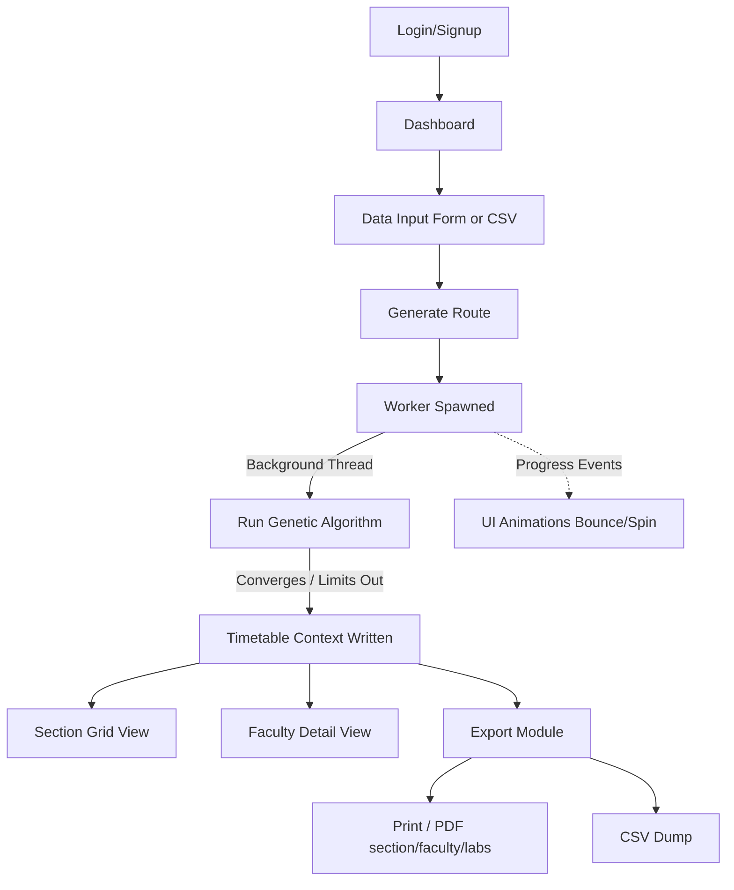

# 📋 Timetable Generator — Complete Project Analysis

> A full-stack **CSE Timetable Generator** built with **Vite + React + TypeScript + TailwindCSS + shadcn/ui**, using **Supabase** for authentication and cloud data persistence. The core scheduling engine uses an advanced **Genetic Algorithm (GA)** running in a **Web Worker** with hard/soft constraint evaluation, alongside beautiful, engaging UI animations.

---

## 🏗️ Tech Stack

| Layer | Technology |
|-------|-----------|
| **Framework** | Vite + React 18 + TypeScript |
| **Styling** | TailwindCSS + shadcn/ui (49 Radix-based components) |
| **State Management** | React Context + `useReducer` |
| **Concurrency** | **Web Workers** (for non-blocking GA execution) |
| **Routing** | React Router DOM v6 |
| **Backend/DB** | Supabase (PostgreSQL + Auth) |
| **Data Fetching** | TanStack React Query |
| **Forms & Validation**| React Hook Form + Zod validation |
| **Charts** | Recharts |
| **Testing** | Vitest + Testing Library |

---

## 📁 Directory Structure

```text
timtablegen2914/
├── index.html                # Entry HTML file
├── package.json              # Dependencies & scripts
├── vite.config.ts            # Vite configuration
├── tailwind.config.ts        # Tailwind theme config
├── tsconfig*.json            # TypeScript configs
├── .env                      # Environment variables
│
├── public/                   # Static files
│
├── supabase/
│   └── migrations/           # SQL migration for DB tables
│
└── src/
    ├── main.tsx              # React entry point
    ├── App.tsx               # Root component (routing + providers)
    ├── index.css             # Global CSS + Tailwind base
    ├── App.css               # App-level styles
    │
    ├── pages/                # 📄 Page-level UI components
    ├── components/           # 🧩 Reusable UI components
    │   ├── ui/               # shadcn/ui primitives (49 files)
    │   ├── layout/           # App layout shell
    │   └── timetable/        # Timetable grid display
    │
    ├── core/                 # 🧠 Algorithm & scheduling logic
    ├── workers/              # ⚙️ Web Workers (gaWorker.ts)
    ├── contexts/             # 🌐 React Context providers
    ├── hooks/                # 🪝 Custom React hooks
    ├── types/                # 📐 TypeScript type definitions
    ├── utils/                # 🔧 Utility functions (Exports, CSV, PDFs)
    ├── integrations/         # 🔌 External service integrations
    │   └── supabase/         # Supabase client & types
    └── lib/                  # Helper library (cn utility)
```

---

## 🗂️ File-by-File Breakdown

### 📄 Pages (`src/pages/`)

| File | Route | Purpose |
|------|-------|---------|
| `Index.tsx` | `/` | **Dashboard** — shows stat cards and quick guide. |
| `DataInput.tsx` | `/input` | **Data Input** — form page for adding faculty, subjects, sections, fixed classes, career path classes, lab rooms. Supports CSV uploads. |
| `Generate.tsx` | `/generate` | **Generate** — orchestrates the Web Worker for the GA. Contains rich, playful DOM animations (bouncing icons, progress bar) so the UI stays responsive and engaging while computing. |
| `ViewTimetable.tsx` | `/view` | **Section View** — shows generated timetable per section in a grid. Interactive, editable cells with constraint validation. |
| `FacultyTimetable.tsx` | `/faculty-view` | **Faculty View** — shows per-faculty timetable with accurate Badges for Theory vs. Lab sessions automatically deduced via pairs logic, avoiding mislabeling. Includes workload summaries. |
| `Export.tsx` | `/export` | **Export** — the hub for CSV exports, PDF Generation for Sections, Faculty, and Labs. Includes "Reset All Data". |
| `Login.tsx` | `/login` | **Login** — email/password sign-in via Supabase Auth |
| `Signup.tsx` | `/signup` | **Signup** — registration via Supabase |
| `NotFound.tsx` | `*` | **404** — not found page |

---

### ⚙️ Concurrency & Workers (`src/workers/`)

**`gaWorker.ts`**: Runs the entire `ConstraintEngine` and `GeneticAlgorithm` in an isolated background thread. 
- Prevents the React UI from freezing during the intense, 500-generation genetic computation process.
- Streams `progress` events back to the main thread (captured in `Generate.tsx`) to drive the loading animation.
- Returns the final generated `GAResult`.

---

### 🧠 Core Algorithm (`src/core/`)

#### Constrained Optimization via Genetic Algorithm (`geneticAlgorithm.ts`)
- **Config**: Population size = 60, Max generations = 500, Mutation rate = 20%.
- **Target**: Chromosome maps to `ClassSession[]` representing complete timetables.
- **Repair Functions**: Built-in routines automatically repair duplicated slots, career path syncs, and lab continuity during mutation/crossover to accelerate convergence before the constraint penalty engine kicks in.

#### Constraint Engine (`constraintEngine.ts`)
Evaluates timetable fitness using Hard constraints (penalty=1000) and Soft constraints (penalty=3-10). The constraints are incredibly comprehensive:

**Hard Constraints:**
| Constraint | What it checks |
|-----------|----------------|
| Faculty conflicts | No faculty double-booked at the same time. |
| Back-to-back | No consecutive theory classes for the same faculty (except 2-hr lab blocks). |
| Post-lab free | Faculty must have a free slot after an intense lab block. |
| **Break Sandwiching** | **NEW**: Prevents classes scheduled directly before AND after a break (Slots 1->2 and 3->4) for a continuous faculty stretch. |
| First-hour diversity | A section cannot have the same subject at slot 0 multiple days. |
| No theory repeats | Theory subject cannot appear twice on the same day per section. |
| Lab continuity | Lab/integrated subjects guarantee exactly 2-hour continuous blocks. |
| Career path sync | All sections of a year have the same day+slot and slotType for CP. |
| Integrated rules | Integrated subjects max 2 hours per day, strictly consecutive. |
| Leisure placement | Leisure ONLY at slot 3 or 5; never at slot 0 or 4; max 1/day. |
| Lab room assignment | Fixed mappings and strict capacity clashes verified. |
| **Strict Capacity Constraints**| Explicit checks for 35-capacity labs (max 2 sections sharing) and 70-capacity reservations. |

**Soft Constraints:**
- Late slot penalty (slot 6 = 5 points)
- Faculty overload (>4 classes/day = 10 × excess)
- Idle gaps between sessions (3 × gap size)
- Faculty workload imbalance across shared subjects.

#### `timeSlotManager.ts`
Manages the daily time slots, integrating invisible break periods:
- **09:00 - 10:00** (Slot 0)
- **10:00 - 11:00** (Slot 1)
- *11:00 - 11:10 (SHORT BREAK)*
- **11:10 - 12:10** (Slot 2)
- **12:10 - 13:10** (Slot 3 - Eligible for Leisure)
- *13:10 - 14:00 (LUNCH BREAK)*
- **14:00 - 15:00** (Slot 4)
- **15:00 - 16:00** (Slot 5 - Eligible for Leisure)
- **16:00 - 17:00** (Slot 6 - Soft penalty late slot)

---

### 📐 Type Definitions (`src/types/timetable.ts`)

The precise data models shaping the application:
- `Faculty`, `Subject`, `Section`, `LabRoom` form the base entities.
- `ClassSession` integrates all metadata including `secondFacultyId`, `labRoomId`, and flags like `isCareerPath`.
- **Note**: The `CareerPathClass` explicitly utilizes `subjectCode` mapping, integrating seamlessly within the standard class paradigm without needing redundant 'subject' naming fields.

---

### 🌐 Contexts (`src/contexts/`)

- **`TimetableContext.tsx`**: State manager with over 40 reduction actions. Dual persistence layer writes to both `localStorage` immediately, alongside a debounced Supabase `JSONB` sync ensuring state survivability.
- **`AuthContext.tsx`**: Reactive wrapper around Supabase Authentication matching session lifecycles.

---

### 🔌 Supabase Database Layer

- `profiles` table: Matches `auth.users`, enforces RLS per user.
- `user_timetable_data` table: Saves the massive JSON blobs generated by the `TimetableContext` logic. Pure NoSQL functionality out of PostgreSQL `JSONB`.

---

### 🔧 Export Utilities (`src/utils/`)

Significant focus placed on comprehensive reporting capabilities:
- **`csvParser.ts`**: Handles bulk imports of faculty, subjects, sections.
- **`exportUtils.ts`**: Section-specific HTML and CSV generation.
- **`facultyPdfExport.ts` / `facultyExportUtils.ts`**: Detailed workload layout exports for the faculty view, retaining break slots and workload summary.
- **`labPdfExport.ts` / `labExportUtils.ts`**: Generates lab-specific schedules merging back-to-back blocks for readable PDF/Print documents.

---

### 🔄 App Flow (User Journey)



---

## 🎯 Distinguishing Highlights & Recent Enhancements

- **Unblocked Main Thread**: Through `gaWorker.ts`, the frontend remains buttery smooth regardless of permutation complexity.
- **Flawless Break Awareness**: Implemented sophisticated `ConstraintEngine` logic ensuring teachers never bear continuous loads stretching identically across morning breaks or lunch slots.
- **Smart Faculty Visualizations**: `FacultyTimetable.tsx` elegantly interpolates consecutive identical sessions as `Lab` badges vs disjointed `Theory` sessions on the fly without database mutations.
- **Enterprise Reporting**: Fully-fledged PDF exports merging identical adjacent slots into continuous blocks exactly as academic organizations need them represented visually.
- **Dynamic Capacity Management**: Algorithms strictly enforce limits on `35` capacity paired lab rooms, and explicit reservations for `70` capacity rooms during critical career path slots.
